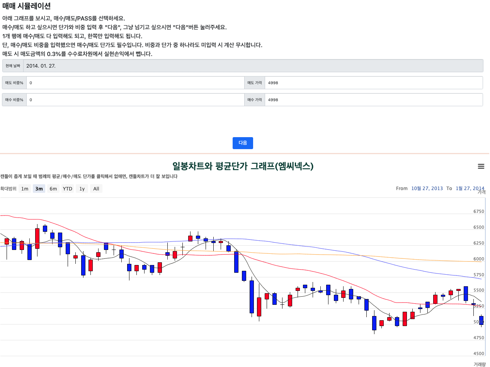
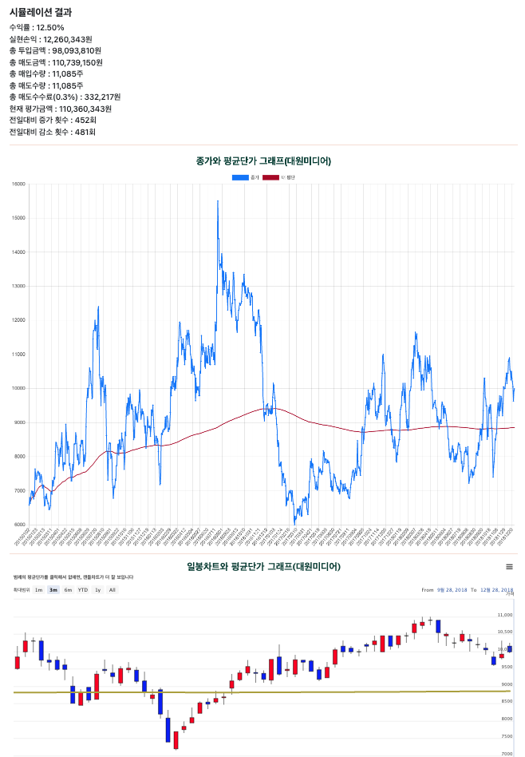
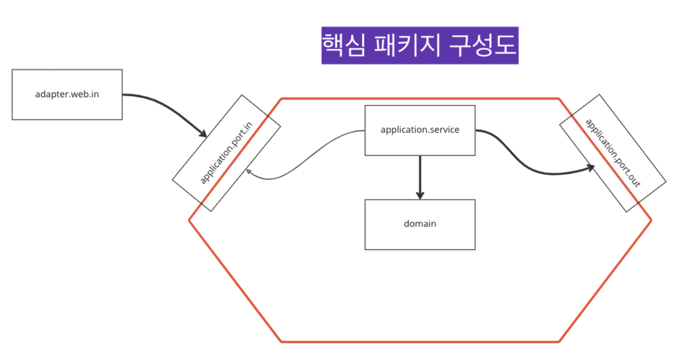

# 주식 매매 시뮬레이션 사이트
[사이트 바로가기 : https://stocksimulation.kr](https://stocksimulation.kr)

# 개요
----------------
주식 초보자(개발자 본인)가 시간 날 때 주식 시뮬레이션을 하며 간접 경험을 쌓고자 만든 사이트.

이 훈련을 통해 주식 투자의 감각을 계속 쌓아나가고, 전체 주식 종목의 파동 형태를 관찰하고 체화해나갈 수 있음.

언젠간 많은 사람들이 이 훈련을 이용해줬으면 하는 바람이 있음.

계좌에 일정 금액을 할당해놓고 비중이라는 개념을 도입하여 비중을 조절하며 일봉차트 기준으로 트레이딩 시뮬레이션을 하는 **과거 일봉차트 매매 시뮬레이션**과,

계좌에 금액 할당을 하지 않고, 매일 일정 금액을 적립식으로 매집하여 특정 기간 동안의 수익률을 시뮬레이션 해보는 **빌드업 자동 시뮬레이션**으로 구성됨.

(주식 일봉차트 데이터는 2000년 1월 1일부터 제공)

## 과거 일봉차트 매매 시뮬레이션
----------------
계좌에 배분할 금액 설정, 기업이름 선택(또는 랜덤), 시작 비중 설정, 시작비중이 있다면 평가손익도 설정, 시작날짜 선택(또는 랜덤)하여 매매 시뮬레이션 시작 가능.

최초 2년치 일봉차트 데이터를 로딩.

당일에 매수/매도할 금액과 비중을 입력하여 '다음'버튼 누르면 그 비중에 상응하는 수량의 주식을 매매하고 다음날 종가 기준으로 실적 업데이트.

매수/매도 하지 않고 '다음'버튼 누르면 관망한다는 뜻으로 아무 행동 하지 않음.

자신만의 스타일로 주식 매매를 만들어가면서 수익 실적 체크하면서 훈련 가능.

## 빌드업 자동 시뮬레이션
----------------
기업이름 선택(또는 랜덤), 시작일과 종료일 설정, 매일 매수 할 금액 설정하여 시작 가능.

시작 시 시뮬레이션 모드를 **매일종가매수** 와 **음봉일 때만 매수**로 선택할 수 있음.

기본적으로 종료일에 전량매도한 실적을 알려주지만, "만약 이 때, 이만큼 매수했더라면?", "만약 이 때, 이만큼 더 팔았더라면?"을 실현할 수 있게,

중간에 매매를 후처리로 끼워넣을 수 있음.

# 기술요소
----------------
* 백엔드 : Java (1.8 이상), Spring Boot(2.5.5), MySql, Mybatis, Nginx, Mybatis
* 프론트엔드 : JSP
* 인프라 : AWS EC2(micro) 내부에 DBMS와 어플리케이션 같이 구동 중. 
* 아키텍처 : 육각형(헥사고날) 아키텍처 지향

# 기타
----------------
* 최근 전종목 주식데이터 API 제공(등록 신청한 사람에 한해 커스터마이징 된 URL 제공하여 JSON 데이터 내려줌.)
* 빌드업 자동 시뮬레이션 소스코드는 새로운 시뮬레이션 모드를 쉽게 추가 가능하도록 확장에 열린 형태로 구현
* 소스코드 핵심 패키지 구성도 : 
